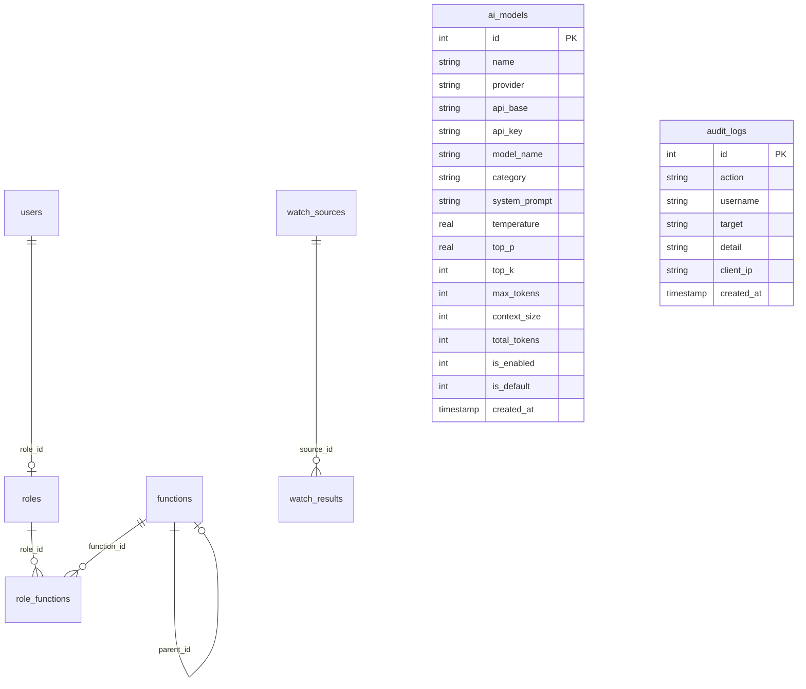

# 🔭 瞭望与问数系统 (DataFinderAgentOS) v0.2

> 基于 Tornado 异步 Web 框架构建的轻量级智能数据采集与 AI 问数平台。

[](https://www.python.org/)
[](https://www.tornadoweb.org/)
[](https://www.sqlite.org/)
[](https://layui.dev/)
[](LICENSE)

---

## 📋 目录

- [项目概述](#项目概述)
- [核心功能](#核心功能)
- [技术架构](#技术架构)
- [项目结构](#项目结构)
- [快速开始](#快速开始)
- [模块详解](#模块详解)
  - [1. 用户认证与安全](#1-用户认证与安全)
  - [2. RBAC 权限管理](#2-rbac-权限管理)
  - [3. 瞭望采集引擎](#3-瞭望采集引擎)
  - [4. 数据仓库](#4-数据仓库)
  - [5. AI 模型引擎](#5-ai-模型引擎)
  - [6. 菜单管理](#6-菜单管理)
- [API 接口一览](#api-接口一览)
- [数据库设计](#数据库设计)
- [安全设计](#安全设计)
- [配置说明](#配置说明)
- [数据库迁移](#数据库迁移)
- [开发指南](#开发指南)
- [默认账户](#默认账户)
- [测试用例](#测试用例)
- [更新日志](#更新日志)
- [许可证](#许可证)

---

## 项目概述

**瞭望与问数系统 (DataFinderAgentOS)** 是一个面向中小团队的智能数据采集与 AI 问数一体化平台。它将 **Web 数据采集（瞭望）** 和 **大语言模型对话（问数）** 两大核心能力整合于统一的 Web 管理后台中，并配备完整的 RBAC 权限体系。

### 核心能力

```
🔐 用户认证与 RBAC 权限管理
🔭 瞭望采集 — 可配置的 Web 数据采集引擎
🗄️ 数据仓库 — 采集结果的统一存储、检索与管理
🤖 模型引擎 — OpenAI 范式 AI 模型的接入管理与流式对话
📊 管理后台 — Layui 精美 UI，开箱即用
```

### 适用场景

- 新闻舆情监控与采集
- 企业内部知识库的数据沉淀
- 多模型 AI 对话的统一管理入口
- 轻量级 RBAC 后台管理系统的快速搭建

---

## 技术架构

### 整体分层

```
┌─────────────────────────────────────────────────┐
│                   Browser (Layui 2.x)            │
├─────────────────────────────────────────────────┤
│                Tornado HTTP Server                │
│  ┌──────────┐ ┌──────────┐ ┌──────────────────┐ │
│  │ Auth     │ │ Admin    │ │ API / SSE Stream │ │
│  │ Handlers │ │ Handlers │ │ Handlers         │ │
│  └────┬─────┘ └────┬─────┘ └───────┬──────────┘ │
│       │             │              │            │
│  ┌────┴─────────────┴──────────────┴──────────┐ │
│  │           Services Layer                    │ │
│  │  ┌─────────────────┐  ┌──────────────────┐ │ │
│  │  │ collector.py    │  │ security.py      │ │ │
│  │  │ (采集+解析+SSRF) │  │ (审计+SSRF校验)   │ │ │
│  │  └─────────────────┘  └──────────────────┘ │ │
│  └────────────────────────────────────────────┘ │
│  ┌────────────────────────────────────────────┐ │
│  │         Repository Layer (Models)           │ │
│  │  UserRepo / RoleRepo / FunctionRepo / ...  │ │
│  └────────────────────┬───────────────────────┘ │
│                       │                         │
│              ┌────────┴────────┐                │
│              │   SQLite (WAL)  │                │
│              └─────────────────┘                │
└─────────────────────────────────────────────────┘
```

### 分层职责

| 层 | 目录 | 职责 |
|----|------|------|
| **Controller** | `app/controllers/` | 请求路由、参数校验、视图渲染、SSE 流式响应 |
| **Service** | `app/services/` | 核心业务逻辑（数据采集、HTML 解析、SSRF 防护） |
| **Model/Repository** | `app/models/` | 数据访问封装，统一使用 Repository 模式 |
| **View** | `app/templates/` | Tornado 原生模板 + Layui 2.x 前端组件 |
| **Utils** | `app/utils/` | 工具函数（密码学、SSRF 校验、审计日志） |
| **Config** | `app/config/` | 全局配置中心，支持环境变量覆盖 |

---

## 技术栈

| 类别 | 技术 | 说明 |
|------|------|------|
| **语言** | Python 3.11+ | 类型注解、现代语法 |
| **Web 框架** | Tornado 6.4+ | 异步非阻塞 HTTP 服务器 |
| **数据库** | SQLite 3 (WAL 模式) | 零配置、嵌入式、单文件 |
| **前端框架** | Layui 2.x | 经典模块化 UI 框架 |
| **前端其他** | 原生 HTML / CSS / JS | 无构建工具依赖 |
| **密码学** | PBKDF2-SHA256 | 60 万轮迭代 + 16 字节随机盐 |
| **数据采集** | Python 标准库 `urllib` | 零第三方爬虫依赖 |
| **HTML 解析** | Python `re` 正则 | 内置解析器，无需 BeautifulSoup |
| **AI 对话** | OpenAI 范式 SSE | 支持 OpenAI / DeepSeek / 智谱 等 |

> **零依赖设计理念**：除 Tornado 外，所有功能均使用 Python 标准库实现（`sqlite3`、`urllib`、`hashlib`、`ssl`、`re` 等），最大化减少外部依赖。

---

## 项目结构

```
DataFinderAgentOS/
├── main.py                       # 程序主入口（路由注册 + 启动）
├── migrate_db.py                 # 数据库迁移脚本（向后兼容）
├── requirements.txt              # Python 依赖清单
├── README.md                     # 项目文档（本文件）
├── .gitignore                    # Git 忽略规则
│
├── database/                     # SQLite 数据库文件目录
│   └── finderos.db               # 主数据库文件（自动生成）
│
├── docs/                         # 项目文档
│   ├── design.md                 # 系统设计文档
│   ├── requirement.md            # 需求文档
│   ├── api.md                    # API 接口文档
│   ├── constraint.md             # 全局开发约束
│   └── test_case.md              # 测试用例清单
│
├── app/
│   ├── config/                   # 配置模块
│   │   ├── __init__.py
│   │   └── settings.py           # 全局配置（环境变量覆盖）
│   │
│   ├── controllers/              # 控制器层（Handler）
│   │   ├── __init__.py
│   │   ├── auth.py               # 登录/登出 + 限速
│   │   ├── base.py               # 公共基础 Handler（认证 + 安全响应头）
│   │   ├── home.py               # 前台主页处理器
│   │   ├── admin_base.py         # 管理后台基础 Handler（权限校验）
│   │   ├── admin_home.py         # 管理后台仪表盘
│   │   ├── admin_user.py         # 用户管理 CRUD
│   │   ├── admin_role.py         # 角色管理 CRUD + 功能树联动
│   │   ├── admin_function.py     # 功能管理 CRUD（树形结构）
│   │   ├── admin_menu.py         # 菜单管理（角色→菜单预览）
│   │   ├── admin_watch.py        # 瞭望采集 + 保存
│   │   ├── admin_watch_source.py # 瞭源管理 CRUD
│   │   ├── admin_warehouse.py    # 数据仓库列表/详情/删除
│   │   └── admin_model.py        # 模型引擎 CRUD + SSE 流式对话
│   │
│   ├── models/                   # 数据模型层（Repository 模式）
│   │   ├── __init__.py
│   │   ├── db.py                 # 数据库连接池 + 建表 + 种子数据
│   │   ├── user.py               # 用户仓储
│   │   ├── role.py               # 角色仓储
│   │   ├── function.py           # 功能仓储
│   │   ├── watch_source.py       # 瞭源仓储
│   │   ├── watch_result.py       # 采集结果 / 数据仓库仓储
│   │   └── ai_model.py           # AI 模型仓储
│   │
│   ├── services/                 # 业务服务层
│   │   ├── __init__.py
│   │   └── collector.py          # 采集引擎（HTTP + 解析 + SSRF）
│   │
│   ├── utils/                    # 工具模块
│   │   ├── __init__.py
│   │   └── security.py           # SSRF 校验 + 审计日志 + CRLF 检测
│   │
│   ├── templates/                # Tornado 模板
│   │   ├── base.html             # 基础模板
│   │   ├── login.html            # 登录页
│   │   └── admin/                # 管理后台模板
│   │       ├── base_layout.html       # 后台布局模板（侧边栏 + 顶栏）
│   │       ├── index.html             # 仪表盘首页
│   │       ├── user_list.html         # 用户列表
│   │       ├── user_form.html         # 用户新增/编辑表单
│   │       ├── role_list.html         # 角色列表
│   │       ├── role_form.html         # 角色表单（含功能权限树）
│   │       ├── function_list.html     # 功能列表（树形展示）
│   │       ├── function_form.html     # 功能表单
│   │       ├── menu.html              # 菜单预览
│   │       ├── watch.html             # 瞭望采集页
│   │       ├── watch_source_list.html # 瞭源列表
│   │       ├── watch_source_form.html # 瞭源表单
│   │       ├── warehouse.html         # 数据仓库列表
│   │       ├── warehouse_detail.html  # 采集结果详情
│   │       ├── model_list.html        # 模型引擎列表
│   │       ├── model_form.html        # 模型表单
│   │       └── model_chat.html        # AI 对话界面
│   │
│   └── static/                   # 静态资源
│       ├── css/
│       │   └── base.css          # 全局样式
│       └── js/
│           └── base.js           # 全局脚本
```

---

## 快速开始

### 环境要求

- **Python**: 3.11 或更高版本
- **操作系统**: Windows / macOS / Linux
- **磁盘空间**: 约 50 MB（含虚拟环境）

### 安装与运行

#### 1. 克隆或解压项目

```bash
cd 瞭望与问数系统v0.2源码
```

#### 2. 创建虚拟环境

```bash
# Windows
python -m venv .venv
.venv\Scripts\activate

# macOS / Linux
python3 -m venv .venv
source .venv/bin/activate
```

#### 3. 安装依赖

```bash
pip install -r requirements.txt
```

> 唯一外部依赖为 `tornado>=6.4`，安装极快。

#### 4. 启动服务

```bash
python main.py
```

启动成功后终端输出：

```
==================================================
  瞭望与问数系统 (DataFinderAgentOS) v0.2
  Server started: http://localhost:10010/
==================================================
```

#### 5. 访问系统

打开浏览器，访问 **http://localhost:10010/**，使用默认账户登录：

| 用户名 | 密码 | 角色 | 跳转页面 |
|--------|------|------|----------|
| `admin` | `admin888` | 系统管理员 | `/admin` 管理后台 |

> 首次启动时系统会自动创建 SQLite 数据库文件 `database/finderos.db`，并插入种子数据（默认角色、管理员账户、功能菜单）。

### 停止服务

在终端按 `Ctrl + C` 即可停止服务。

---

## 模块详解

### 1. 用户认证与安全

#### 1.1 登录流程

```
用户输入凭证 → 频率限制检查 → PBKDF2 密码验证
    → 成功: set_secure_cookie + 按角色跳转（管理员→/admin，普通用户→/index）
    → 失败: 记录失败次数 + 返回错误提示
```

#### 1.2 安全特性

| 特性 | 实现方式 |
|------|---------|
| **密码存储** | PBKDF2-SHA256，60 万轮迭代，16 字节随机盐（hex 存储） |
| **会话管理** | Tornado Secure Cookie（`set_secure_cookie` / `get_secure_cookie`） |
| **CSRF 防护** | 全局 `xsrf_cookies=True`，模板中 `` |
| **登录限速** | IP + 用户名维度，5 次失败 / 15 分钟锁定窗口 |
| **安全响应头** | CSP、X-Frame-Options、X-Content-Type-Options、X-XSS-Protection 等 |
| **审计日志** | 登录/登出/锁定等关键操作写入 `audit_logs` 表 |

#### 1.3 认证拦截链

```
未登录请求
    → BaseHandler.get_current_user() 返回 None
    → @tornado.web.authenticated 拦截
    → 302 重定向到 login_url="/"
```

---

### 2. RBAC 权限管理

#### 2.1 权限模型

```
用户 (users)  ──1:1──▶  角色 (roles)  ──M:N──▶  功能 (functions)
                                                    │
                                              parent_id 自引用
                                              （支持两级树形结构）
```

- **用户 ↔ 角色**：每个用户绑定一个角色
- **角色 ↔ 功能**：通过 `role_functions` 中间表实现多对多关联
- **功能**：支持两级树形（parent_id 自引用），每项功能可配置图标、路由、排序

#### 2.2 用户管理 (`/admin/user`)

- 列表查看（20 条/页）、关键词搜索
- 新增用户：用户名 + 密码 + 角色选择
- 编辑用户：修改密码（留空不修改）、更换角色
- 启用/禁用切换
- 删除用户（软性保护：`admin` 不可删除/禁用自身）
- 三区布局：上（搜索 + 操作按钮）、中（数据表格）、下（分页）

#### 2.3 角色管理 (`/admin/role`)

- 新增/编辑/删除角色
- **系统角色保护**：`is_system=1` 的角色（系统管理员、普通用户）不可编辑/删除
- **功能权限联动**：通过 Layui 树形组件（`tree`）展示全部功能，勾选即授权
- 自动同步 `role_functions` 中间表

#### 2.4 功能管理 (`/admin/function`)

- 新增/编辑/删除/启用禁用功能
- **禁用级联**：禁用某项功能后，自动清除所有角色对该功能的关联
- 树形展示（一级 + 二级）
- 支持配置图标（Layui 图标类名）、路由地址、排序

#### 2.5 默认权限体系

| 角色 | 后台访问 | 说明 |
|------|---------|------|
| 系统管理员 (id=1) | ✅ 全部功能 | 拥有所有后台功能的访问权限 |
| 普通用户 (id=2) | ❌ 仅前台 | 只能访问登录后的前台主页 |
| 自定义角色 | 取决于配置 | 通过角色管理分配具体功能权限 |

---

### 3. 瞭望采集引擎

#### 3.1 概述

瞭望采集引擎是系统的核心数据入口，支持配置多个「瞭望源」（Watch Source），通过 URL 模板 + 关键词 + HTTP 请求的方式自动抓取并解析 Web 数据。

#### 3.2 采集流程

```
用户输入关键词
    → 选择瞭望源（URL 模板 + 自定义 Headers）
    → collector.py 拼装 URL（{keyword} / {page} 占位符替换）
    → SSRF 安全校验（协议白名单 + 内网 IP 拦截 + DNS 解析校验）
    → 发起 HTTP GET 请求（模拟 Chrome 138 TLS 指纹）
    → 响应解压（gzip / deflate）
    → 按 parser 类型解析 HTML
    → 结构化结果返回
    → 保存到 watch_results 表
    → （可选）标记保存到数据仓库
```

#### 3.3 内置解析器

| 解析器 | 标识 | 适用场景 | 解析能力 |
|--------|------|---------|---------|
| `parse_baidu_news` | `baidu_news` | 百度新闻搜索 | 标题、链接、摘要、来源 |
| `parse_sogou_news` | `sogou_news` | 搜狗新闻搜索 | 标题、链接、摘要 |
| `generic_parse` | `generic` | 通用网页 | 提取 h2/h3 标签中的链接 |

#### 3.4 瞭源管理 (`/admin/watch/source`)

瞭望源是可复用的数据采集配置，核心字段：

| 字段 | 说明 | 示例 |
|------|------|------|
| `name` | 瞭源名称 | 百度新闻 |
| `url_template` | URL 模板 | `https://www.baidu.com/s?tn=news&word={keyword}&pn={(page-1)*10}` |
| `request_headers` | 自定义 HTTP 请求头 (JSON) | `{"Referer":"https://www.baidu.com/"}` |
| `sort_order` | 排序权重 | 数字越小越靠前 |
| `is_enabled` | 启用状态 | 可随时禁用某个瞭源 |

支持的操作：新增、编辑、删除、启用/禁用切换。

#### 3.5 百度反爬策略

- 首次访问百度时会自动预热 Cookie（获取 `BAIDUID`）
- 使用全局 CookieJar 维持会话
- 模拟 Chrome 138 浏览器的 TLS 指纹和 User-Agent
- 请求间隔建议 ≥ 3 秒

---

### 4. 数据仓库

#### 4.1 概述

数据仓库 (`/admin/warehouse`) 是瞭望采集结果的统一存储与检索中心。所有采集到的新闻/数据都会保存在 `watch_results` 表中，支持关键词搜索、分页查看、详情预览、单条删除和批量删除。

#### 4.2 主要功能

- **列表浏览**：分页展示所有采集结果（20 条/页），含瞭源名称、关键词、采集时间
- **关键词搜索**：按采集关键词模糊检索
- **统计概览**：显示总采集条数、成功/失败统计
- **详情查看**：点击查看单条记录的完整响应内容
- **批量删除**：勾选多条后一键删除
- **数据保存标记**：从瞭望采集页可将结果标记为"已保存到仓库"

---

### 5. AI 模型引擎

#### 5.1 概述

模型引擎提供多 Provider（OpenAI / DeepSeek / 智谱 AI / 百度文心 / 自定义）AI 大模型的统一管理平台，支持模型配置、流式对话（SSE）、Token 统计和对话审计。

#### 5.2 模型管理 (`/admin/model`)

每个模型支持完整的参数配置：

| 参数 | 说明 | 默认值 |
|------|------|--------|
| `name` | 模型显示名称 | — |
| `provider` | 提供商 | openai |
| `api_base` | API 端点 URL | — |
| `api_key` | API 密钥 | — |
| `model_name` | 模型标识（如 `gpt-4o`） | — |
| `category` | 分类 | text（文本）/ vision（视觉）/ embedding（嵌入） |
| `system_prompt` | 系统提示词 | — |
| `temperature` | 温度参数 | 0.7 |
| `top_p` | Top-P 采样 | 1.0 |
| `top_k` | Top-K 采样 | 50 |
| `max_tokens` | 最大输出 Token | 4096 |
| `context_size` | 上下文窗口大小 | 8192 |
| `total_tokens` | Token 消耗累计（自动更新） | 0 |
| `is_default` | 是否默认模型 | — |

#### 5.3 流式对话 (`/admin/model/chat`)

```
用户选择模型 → 输入消息
    ├── 有 API Key → 真实 OpenAI API SSE 流式调用 → 返回 Token 消耗
    └── 无 API Key → 本地 Mock 字符级流式输出 → 估算 Token
    → Token 消耗自动累加到 ai_models.total_tokens
    → 对话记录写入 audit_logs (CHAT)
```

- **SSE 事件格式**：
  ```
  data: {"content": "你"}
  data: {"content": "好"}
  ...
  data: [DONE]
  event: stats
  data: {"tokens": 42, "mock": false}
  ```
- **Mock 模式**：API Key 未配置时自动回退到本地模拟流式输出
- **连接管理**：客户端断开时自动中止服务端请求

---

### 6. 菜单管理

#### 6.1 概述

菜单管理 (`/admin/menu`) 提供按角色预览后台侧边栏菜单树的功能。选择角色后，系统根据 `roles → role_functions → functions` 的映射关系，动态构建该角色可见的菜单结构。

#### 6.2 菜单生成逻辑

```
角色 → role_functions (中间表) → functions (按 parent_id 构建树)
    → 过滤 is_enabled=1 的功能
    → 按 sort_order 排序
    → 渲染为 Layui 侧边栏菜单
```

支持以 JSON 格式展示菜单原始结构，便于调试和对接。

---

## API 接口一览

> 基础 URL: `http://localhost:10010` | 认证方式: Tornado Secure Cookie | CSRF: 所有 POST 需 `_xsrf` token

### 认证

| 方法 | 路径 | 说明 |
|------|------|------|
| GET/POST | `/` | 登录页 / 登录提交 |
| GET | `/logout` | 登出 |

### 管理后台 (需管理员权限)

#### 用户管理
| 方法 | 路径 | 说明 |
|------|------|------|
| GET | `/admin/user` | 用户列表 (`?page=&search=`) |
| GET/POST | `/admin/user/add` | 新增用户 |
| GET/POST | `/admin/user/edit` | 编辑用户 (`?id=`) |
| POST | `/admin/user/delete` | 删除用户 |
| POST | `/admin/user/toggle` | 启用/禁用切换 |

#### 角色管理
| 方法 | 路径 | 说明 |
|------|------|------|
| GET | `/admin/role` | 角色列表 |
| GET/POST | `/admin/role/add` | 新增角色 |
| GET/POST | `/admin/role/edit` | 编辑角色 |
| POST | `/admin/role/delete` | 删除角色 |

#### 功能管理
| 方法 | 路径 | 说明 |
|------|------|------|
| GET | `/admin/function` | 功能列表（树形） |
| GET/POST | `/admin/function/add` | 新增功能 |
| GET/POST | `/admin/function/edit` | 编辑功能 |
| POST | `/admin/function/delete` | 删除功能 |
| POST | `/admin/function/toggle` | 启用/禁用功能 |

#### 菜单管理
| 方法 | 路径 | 说明 |
|------|------|------|
| GET | `/admin/menu` | 按角色预览菜单树 |

#### 瞭望采集
| 方法 | 路径 | 说明 |
|------|------|------|
| GET | `/admin/watch` | 瞭望采集页 + 历史查询 |
| POST | `/admin/watch` | 执行采集（返回 JSON） |
| POST | `/admin/watch/save` | 保存结果到数据仓库 |

#### 瞭源管理
| 方法 | 路径 | 说明 |
|------|------|------|
| GET | `/admin/watch/source` | 瞭源列表 |
| GET/POST | `/admin/watch/source/add` | 新增瞭源 |
| GET/POST | `/admin/watch/source/edit` | 编辑瞭源 |
| POST | `/admin/watch/source/delete` | 删除瞭源 |
| POST | `/admin/watch/source/toggle` | 启用/禁用瞭源 |

#### 数据仓库
| 方法 | 路径 | 说明 |
|------|------|------|
| GET | `/admin/warehouse` | 数据列表 (`?page=&keyword=`) |
| GET | `/admin/warehouse/detail` | 查看详情 (`?id=`) |
| POST | `/admin/warehouse/delete` | 删除记录 |
| POST | `/admin/warehouse/batch-delete` | 批量删除 |

#### 模型引擎
| 方法 | 路径 | 说明 |
|------|------|------|
| GET | `/admin/model` | 模型列表 (`?page=&category=`) |
| GET/POST | `/admin/model/add` | 新增模型 |
| GET/POST | `/admin/model/edit` | 编辑模型 |
| POST | `/admin/model/delete` | 删除模型 |
| POST | `/admin/model/toggle` | 启用/禁用 |
| POST | `/admin/model/default` | 设为默认模型 |
| GET | `/admin/model/chat` | 对话页面 (`?model_id=`) |
| POST | `/admin/model/chat/stream` | **SSE 流式对话** |
| GET | `/admin/api/model/list` | 模型 JSON API |

---

## 数据库设计

### ER 关系图



### 核心表清单

| 表名 | 说明 | 记录数级 |
|------|------|---------|
| `users` | 用户表 | 10~1000 |
| `roles` | 角色表 | 3~50 |
| `functions` | 功能/菜单项 | 10~100 |
| `role_functions` | 角色-功能关联（中间表） | N×M |
| `watch_sources` | 瞭望源配置 | 3~50 |
| `watch_results` | 采集结果/数据仓库 | 100~100000 |
| `ai_models` | AI 模型配置 | 3~50 |
| `audit_logs` | 操作审计日志 | 自动增长 |

> 完整 DDL 和字段说明请参考 `docs/constraint.md`。

---

## 安全设计

### 防护体系总览

| 防护项 | 实现方式 | 参考标准 |
|--------|---------|---------|
| **密码存储** | PBKDF2-SHA256 (60 万轮 + 16字节随机盐) | OWASP 2023 |
| **CSRF** | Tornado `xsrf_cookies=True` 全局开启 | OWASP A01:2021 |
| **XSS** | Tornado 模板默认 HTML 转义 + 采集内容清洗 | OWASP A03:2021 |
| **SQL 注入** | 全参数化查询 (`?` 占位符)，杜绝字符串拼接 | OWASP A03:2021 |
| **SSRF** | URL 协议白名单 + 内网 IP 段拦截 + DNS 解析校验 + CRLF 检测 | OWASP A10:2021 |
| **Header 注入** | CR/LF 字符检测（`has_crlf()`） | OWASP A03:2021 |
| **安全响应头** | CSP / X-Frame-Options / X-Content-Type-Options / X-XSS-Protection / Referrer-Policy / Permissions-Policy / HSTS | OWASP |
| **登录限速** | IP + 用户名维度，5 次失败 / 15 分钟锁定 | OWASP A07:2021 |
| **审计日志** | 关键操作全量写入 `audit_logs` 表 | OWASP A09:2021 |

### SSRF 防护详情

```
validate_url_safe(url)
    ├── 协议白名单: 仅允许 http / https
    ├── CRLF 检测: 拒绝含 \r \n 的 URL
    ├── DNS 解析: hostname → IP
    └── IP 黑名单检查:
        ├── 127.0.0.1 / localhost / 0.0.0.0 / ::1
        ├── 10.0.0.0/8 (A 类私有)
        ├── 172.16.0.0/12 (B 类私有)
        ├── 192.168.0.0/16 (C 类私有)
        ├── 169.254.0.0/16 (链路本地)
        └── 100.64.0.0/10 (运营商级 NAT)
```

### 安全响应头

```
Content-Security-Policy: default-src 'self'; script-src 'self' 'unsafe-inline' 'unsafe-eval' https://cdn.jsdelivr.net; ...
X-Frame-Options: DENY
X-Content-Type-Options: nosniff
X-XSS-Protection: 1; mode=block
Referrer-Policy: strict-origin-when-cross-origin
Permissions-Policy: camera=(), microphone=(), geolocation=()
```

---

## 配置说明

### 配置文件

所有配置集中在 `app/config/settings.py`，支持**环境变量覆盖**，无需修改代码即可适配不同环境。

### 配置项速查

| 环境变量 | 默认值 | 说明 |
|---------|--------|------|
| `COOKIE_SECRET` | 随机生成 | 安全 Cookie 签名密钥（生产环境**必须**设置） |
| `DB_PATH` | `database/finderos.db` | SQLite 数据库文件路径 |
| `PORT` | `10010` | HTTP 服务监听端口 |
| `BIND_ADDRESS` | `127.0.0.1` | 监听地址 |
| `DEBUG` | `false` | 调试模式（`true` 开启） |
| `PBKDF2_ITERATIONS` | `600000` | 密码哈希迭代次数 |
| `PAGE_SIZE` | `20` | 列表默认分页大小 |
| `LOGIN_MAX_FAILURES` | `5` | 登录失败次数上限 |
| `LOGIN_LOCKOUT_SECONDS` | `900` | 登录锁定时间（秒） |
| `AUDIT_ENABLED` | `true` | 是否启用审计日志 |

### 生产环境启动示例

```bash
# Linux/macOS
export COOKIE_SECRET="$(python -c 'import secrets; print(secrets.token_hex(32))')"
export DEBUG=false
export BIND_ADDRESS="0.0.0.0"
python main.py

# Windows PowerShell
$env:COOKIE_SECRET = -join ((48..57)+(65..90)+(97..122) | Get-Random -Count 64 | ForEach-Object {[char]$_})
$env:DEBUG = "false"
$env:BIND_ADDRESS = "0.0.0.0"
python main.py
```

> ⚠️ **安全警告**：生产环境必须通过环境变量设置 `COOKIE_SECRET`，否则每次重启会生成随机密钥导致所有用户会话失效。

---

## 数据库迁移

当系统升级添加新字段/新表时，运行迁移脚本以保持数据库结构同步：

```bash
# 执行所有待处理的迁移
python migrate_db.py

# 查看迁移状态
python migrate_db.py --status
```

### 迁移历史

| 版本 | 变更内容 |
|------|---------|
| v0.2.5 | 添加 `ai_models.total_tokens`（Token 累加统计） |
| v0.2.5 | 添加 `audit_logs` 表（操作审计日志） |
| v0.2.5 | 添加安全相关索引 |

> 迁移脚本具有**幂等性**：重复执行不会破坏已有数据。

---

## 开发指南

### 添加新业务模块

以添加一个新模块为例，需要创建/修改以下文件：

1. **Model (Repository)**：在 `app/models/` 新建文件，定义数据访问类（静态方法）
2. **Controller (Handler)**：在 `app/controllers/` 新建文件，继承 `AdminBaseHandler`
3. **Template**：在 `app/templates/admin/` 新建模板，继承 `base_layout.html`
4. **路由注册**：在 `main.py` 的 `make_app()` 中添加路由
5. **数据库表**：在 `app/models/db.py` 的 `init_db()` 中添加建表语句
6. **菜单功能项**：在后台功能管理中新增功能节点

### 代码规范

- **Controller 层**：参数校验 → 业务调用 → 视图渲染，保持简洁
- **Model 层**：纯数据访问，使用 Repository 模式，方法为 `@staticmethod`
- **Service 层**：复杂业务逻辑（如采集引擎），可复用组件
- **数据库操作**：必须使用参数化查询（`?` 占位符），**严禁字符串拼接 SQL**
- **模板继承**：后台页面继承 `admin/base_layout.html`，自动包含侧边栏和顶栏

### 常用命令

```bash
# 激活虚拟环境 (Windows)
.venv\Scripts\activate

# 安装依赖
pip install -r requirements.txt

# 运行数据库迁移
python migrate_db.py

# 启动开发服务器
python main.py

# 切换端口 (默认 10010)
# Windows PowerShell:
$env:PORT = "8080"; python main.py
# Linux/macOS:
PORT=8080 python main.py
```

---

## 默认账户

| 用户名 | 密码 | 角色 | 后台权限 |
|--------|------|------|---------|
| `admin` | `admin888` | 系统管理员 | 全部功能 |

> ⚠️ **首次登录后请立即修改默认密码！**

---

## 测试用例

系统已覆盖 6 大模块共 27 项测试用例，详见 `docs/test_case.md`：

| 模块 | 测试项数 | 覆盖要点 |
|------|---------|---------|
| 认证模块 | 6 | 正确/错误登录、空表单、限速、未登录拦截、登出 |
| 用户管理 | 6 | 新增/编辑/禁用/删除/搜索/admin 保护 |
| 角色管理 | 3 | 新增角色、系统角色编辑/删除保护 |
| 瞭望采集 | 5 | 关键词采集、瞭源选择、保存仓库、SSRF 防护、空关键词 |
| 模型引擎 | 6 | 新增模型、默认设置、Mock 对话、真实 API、Token 统计、审计日志 |
| 安全测试 | 5 | XSS、SQL 注入、CSRF、密码哈希、安全响应头 |

---

## 更新日志

### v0.2 (2026-07)
- ✅ **Day6-2 扩展模块**：瞭望采集引擎、瞭源管理、数据仓库、AI 模型引擎
- ✅ **模型引擎**：多 Provider 支持（OpenAI / DeepSeek / 智谱 / 百度文心 / 自定义）
- ✅ **SSE 流式对话**：真实 API + 本地 Mock 回退，Token 消耗统计
- ✅ **瞭望采集**：百度新闻 / 搜狗新闻 / 通用解析器，URL 模板占位符
- ✅ **数据仓库**：采集结果统一存储、检索、批量管理
- ✅ **SSRF 防护**：协议白名单 + 内网 IP 拦截 + DNS 解析校验 + CRLF 检测
- ✅ **审计日志**：`audit_logs` 表，关键操作全量记录
- ✅ **安全增强**：OWASP 推荐安全响应头、Cookie 预热反爬、Token 统计

### v0.1 (2026-07)
- ✅ **Day6-1 权限管理子系统**：用户/角色/功能/菜单完整 CRUD
- ✅ **RBAC 权限模型**：用户→角色→功能，树形功能结构
- ✅ **登录认证**：PBKDF2-SHA256 + 登录限速 + 审计日志
- ✅ **管理后台**：Layui 2.x 精美 UI，三区布局
- ✅ **系统保护**：admin 账号保护、系统角色保护、功能禁用级联

---

## 许可证

本项目仅用于学习和内部使用。

---

> 📖 更多技术细节请参阅 `docs/` 目录下的设计文档、API 文档、开发约束和测试用例清单。
│   │       ├── function_list.html # 功能列表
│   │       ├── function_form.html # 功能新增/编辑表单
│   │       └── menu.html          # 菜单管理
│   └── static/               # 静态资源
│       ├── css/base.css
│       └── js/base.js
├── database/                 # SQLite 数据库文件目录
└── docs/
    └── constraint.md         # 开发规范文档
```

## 快速开始

### 1. 创建虚拟环境并安装依赖

```bash
python -m venv venv

# Windows
venv\Scripts\activate
pip install -r requirements.txt

# Linux/macOS
source venv/bin/activate
pip install -r requirements.txt
```

### 2. 启动服务

```bash
# Windows
venv\Scripts\activate
python main.py

# Linux/macOS
source venv/bin/activate
python main.py
```

### 3. 访问系统

浏览器打开 http://localhost:10010/

- 首次启动会自动创建 SQLite 数据库和所有表结构
- 种子数据自动创建默认管理员账号：
  - 用户名：`admin`
  - 密码：`admin888`

## 功能特性

- ✅ 用户登录/登出（PBKDF2-SHA256 密码哈希 + 随机盐）
- ✅ 基于 Secure Cookie 的会话管理
- ✅ XSRF 跨站请求伪造防护
- ✅ SQL 参数化查询防注入
- ✅ 已登录用户自动跳转后台
- ✅ 未登录访问拦截（自动重定向到登录页）
- ✅ Layui 后台管理框架
- ✅ Repository 模式数据访问层

## 安全说明

本项目为原型框架版本，生产环境部署前需：

1. 定期备份 `database/finderos.db`
