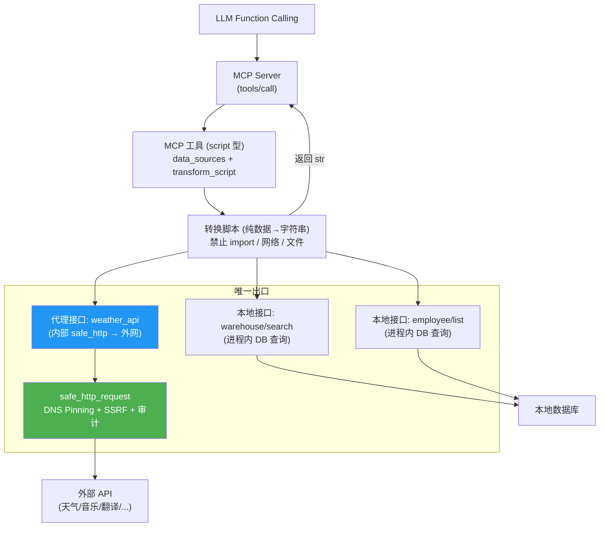

# 统一接口驱动架构重构方案 (Unified API-Driven Architecture)

> 文档日期: 2026-07-15  
> 目标版本: 待定（MRP 完成后确定）  
> 前置依赖: `docs/mcp_refactor_plan.md`（MRP）全部 Phase 完成后  
> 基于: DataFinderAgentOS v1.0.0-beta 当前代码  

---

## 文档导航

本方案按模块拆分为以下文档：

| 文档 | 内容 |
|------|------|
| **README.md**（本文档） | 架构总览：动机、三层模型、数据流、收益总结 |
| [01-database-schema.md](./01-database-schema.md) | 数据库变更方案：`api_interfaces` / `mcp_tools` 表字段变更、迁移策略 |
| [02-local-api-layer.md](./02-local-api-layer.md) | 本地接口层设计：函数注册表、18 个内置接口、外部代理注册 |
| [03-script-engine.md](./03-script-engine.md) | 脚本执行引擎：AST 白名单沙箱、安全策略、脚本示例 |
| [04-mcp-registry-refactor.md](./04-mcp-registry-refactor.md) | MCP 注册中心改造：`_build_script_tool()`、新旧对比 |
| [05-frontend-design.md](./05-frontend-design.md) | 前端管理界面：接口管理列表、MCP 工具编辑页 |
| [06-file-changes.md](./06-file-changes.md) | 文件变更清单：新建/修改文件一览 |
| [07-integration-points.md](./07-integration-points.md) | 关键集成点适配：user_chat、LLM API、权限过滤、防火墙 |
| [08-migration-plan.md](./08-migration-plan.md) | 迁移计划 & 兼容策略：6 个 Phase 步骤 + 四种 tool_type 共存 |

---

## 〇、与 MRP 的关系

本文档是 `mcp_refactor_plan.md`（MRP）的**远期上层建筑**，不是替代方案。

| 维度 | MRP (待定) | 本文档 (待定) |
|------|-------------|-------------------|
| **核心目标** | MCP 工具数据库驱动 + 管理后台 + 员工权限 | 接口统一管理 + MCP 工具可配置脚本化 |
| **tool_type** | `builtin` / `api` / `crawl4ai` 三分类 | 新增 `script` 型，与现有三分类**共存** |
| **handler_module** | 保留，builtin 型核心机制 | 保留不动；`script` 型作为新增可选路径 |
| **builtin_tools/** | 按分类拆分为子包 | 保留不动；额外在 `api_interfaces` 中注册元数据 |
| **api_interfaces 表** | 不修改 | 新增 `interface_type`、`is_system`、`local_handler` 列 |
| **关系** | **先实施**，提供 MCP 基础设施 | **后实施**，基于 MRP 成果向上抽象 |

**实施原则**：MRP 全部 Phase 完成后，代码中已有完整的 MCP 工具注册表、管理后台和权限过滤。本文档在此基础上叠加「接口统一管理」和「脚本化工具」两层能力，**不推翻 MRP 的任何设计决策**。

---

## 一、重构动机

### 1.1 核心问题

当前架构存在两个分离的概念层级，导致概念重叠和维护困难：

| 当前概念 | 职责 | 问题 |
|----------|------|------|
| **MCP 工具** (`mcp_tools`) | 注册工具供 LLM 调用 | `builtin` 型直接调 Python 函数；`api` 型封装 HTTP 请求——两种形态混在一起 |
| **接口管理** (`api_interfaces`) | 管理可复用 HTTP 接口模板 | 仅服务 API 型数字员工，和 MCP 工具没有关联 |
| **内置工具** (`builtin_tools/`) | 实现具体功能的 Python 函数 | 部分工具（如音乐 `_get_random_music`）本质是对外部 HTTP API 的封装，但被标记为 `builtin` 型，管理员无法在界面查看/修改其调用的 API 地址 |

**本质矛盾**：音乐推荐（`api.injahow.cn`）、天气查询等本质就是「调 HTTP API 返回 JSON」。当前 `_get_random_music()` 代码中已是 HTTP 调用，但在数据库中被标为 `tool_type='builtin'`，管理员不可见其 API 地址。天气则做成了 API 型数字员工而非 MCP 工具，未被 LLM Function Calling 统一调度。

### 1.2 重构目标

```
         ┌──────────────────────────────────────────┐
         │      MCP 工具（对 LLM 暴露的能力）          │
         │   = 本地接口数据源 × N + 纯数据转换脚本     │
         │   脚本仅接收本地接口数据，返回字符串         │
         └──────────────┬───────────────────────────┘
                        │ 引用（仅 local）
         ┌──────────────▼───────────────────────────┐
         │      接口管理（统一代理所有出口流量）        │
         │  ┌──────────────────────────────────┐    │
         │  │       本地接口 (local)             │    │
         │  │  · 系统内置函数 (18个，进程内直调)   │    │
         │  │  · 外部 API 代理 (自动包装为 local) │    │
         │  │  · 上层代码只看到 local，感知不到外网 │    │
         │  └──────────────────────────────────┘    │
         │                │                          │
         │    ┌───────────▼───────────┐              │
         │    │  safe_http_request    │ ← 唯一出口   │
         │    │  (DNS Pinning + SSRF) │   所有外网   │
         │    └───────────────────────┘   流量经此   │
         └──────────────────────────────────────────┘
```

**一句话总结**：接口管理是系统**唯一的对外网络出口**。所有外部 API 在接口管理层注册后自动包装为本地接口（虚拟 local handler），对内透明代理。脚本层只能引用本地接口，完全感知不到外网——脚本做纯数据转换，返回字符串作为 MCP 工具结果。

---

## 二、新架构总览

### 2.1 三层模型

```
┌──────────────────────────────────────────────────────────────────┐
│                     Layer 3: MCP 工具层                           │
│  对 LLM 暴露的 Function Calling 工具。                             │
│  每个工具 = [本地接口数据源 × 1..N] + 纯数据转换脚本               │
│  脚本只能引用本地接口，返回字符串（直接作为 MCP text content）      │
├──────────────────────────────────────────────────────────────────┤
│                     Layer 2: 接口管理层（唯一网络出口）             │
│  统一管理所有 API 接口模板，是所有外部 HTTP 流量的唯一出口。        │
│  ┌──────────────────────────────────────────────────────────┐    │
│  │               本地接口 (local) — 上层唯一可见               │    │
│  │  ┌─────────────────────┐  ┌─────────────────────────┐    │    │
│  │  │ 系统内置 (18个)       │  │ 外部代理 (自动注册)       │    │    │
│  │  │ · 进程内函数直调      │  │ · external 接口自动包装   │    │    │
│  │  │ · is_system=1        │  │   为虚拟 local handler   │    │    │
│  │  │ · 如: warehouse/     │  │ · 内部走 safe_http_      │    │    │
│  │  │   search, employee/  │  │   request (DNS Pinning   │    │    │
│  │  │   list, skill/load   │  │   + SSRF + 审计日志)     │    │    │
│  │  └─────────────────────┘  └─────────────────────────┘    │    │
│  └──────────────────────────────────────────────────────────┘    │
│  注意: 瞭望采集、音乐API、员工API调用等所有出站流量均经此层        │
├──────────────────────────────────────────────────────────────────┤
│                     Layer 1: 脚本执行引擎                         │
│  安全执行用户编写的纯数据转换脚本。                                │
│  · 输入: 本地接口返回的 dict (data_sources)                       │
│  · 输出: str — 直接作为 MCP tools/call 的 text content            │
│  · 沙箱: 完全禁止 import / __builtins__ / 网络 / 文件系统         │
│  · 脚本无需（也不能）发起任何外部调用——接口管理层已代理完毕        │
└──────────────────────────────────────────────────────────────────┘
```

> 各层的详细设计见子文档：[本地接口层](./02-local-api-layer.md) | [脚本引擎](./03-script-engine.md) | [MCP 注册中心](./04-mcp-registry-refactor.md)

### 2.2 数据流



### 2.3 调用流程详解

```
1. LLM 发起 Function Calling → tools/call { name: "get_weather", arguments: {city: "成都"} }
2. MCP Server 查找工具 "get_weather" (tool_type='script')
3. 工具配置:
   data_sources: [
     { interface_id: 5, param_mapping: { city: "city" } }
     // interface_id=5 是 external 接口"天气API"，但已被接口管理层包装为虚拟 local handler
     // 对脚本而言，它和其他本地接口无异，完全不感知外网
   ]
   transform_script: |
     def transform(data_sources):
         w = data_sources[0]["data"]["current"]
         return f"{w['city']}今天{w['desc']}，温度{w['temp']}℃，湿度{w['humidity']}%"
4. 执行:
   a. registry._build_script_tool() 构建 handler
   b. handler 遍历 data_sources，每个都通过 call_local_api() 调用
      - interface_id=5 → 实际触发 safe_http_request("https://api.weather.com/...")
      - DNS Pinning → SSRF 校验 → 审计日志 → 返回 JSON
   c. 所有 data_sources 结果收集完毕后，传入脚本
   d. 脚本 transform() 返回字符串
5. 字符串直接作为 MCP text content 返回给 LLM
```

> **核心安全原则**：脚本层和 MCP 工具层完全感知不到外网。所有外部 HTTP 调用被接口管理层的
> `safe_http_request` 统一代理。可在网络层部署防火墙：**仅允许接口管理服务进程访问外网**。
> 详细集成方案见 [关键集成点适配](./07-integration-points.md)。

---

## 三、架构收益总结

| 维度 | 收益 |
|------|------|
| **安全出口统一** | 所有外部 HTTP 流量经 `api_interfaces` → `safe_http_request`（DNS Pinning + SSRF + 审计），消除分散出口的 SSRF 风险 |
| **透明代理** | external 接口启动时自动包装为虚拟 local handler，上层代码（MCP 工具、脚本）无需感知内外网区别 |
| **脚本极简化** | 脚本仅做纯数据→字符串转换，禁 import、禁网络、禁文件。AST 沙箱从 ~200 行简化到 ~130 行 |
| **防火墙友好** | 唯一出站进程路径明确，可部署网络层规则：仅允许接口管理服务访问外网 |
| **热重载即时生效** | script 型工具的接口配置和脚本均在数据库中，修改后重载即可，无需重启或改代码 |
| **内部能力复用** | 18 个系统内置 + N 个代理接口全部注册在 `_LOCAL_HANDLER_MAP`，可被任意 script 型工具组合引用 |
| **MCP 协议原生对齐** | 脚本返回 `str`，直接映射为 MCP `text content`，LLM 友好，无需额外 JSON 包装 |

---

> **文档维护**: 本文档随架构重构实施同步更新。
