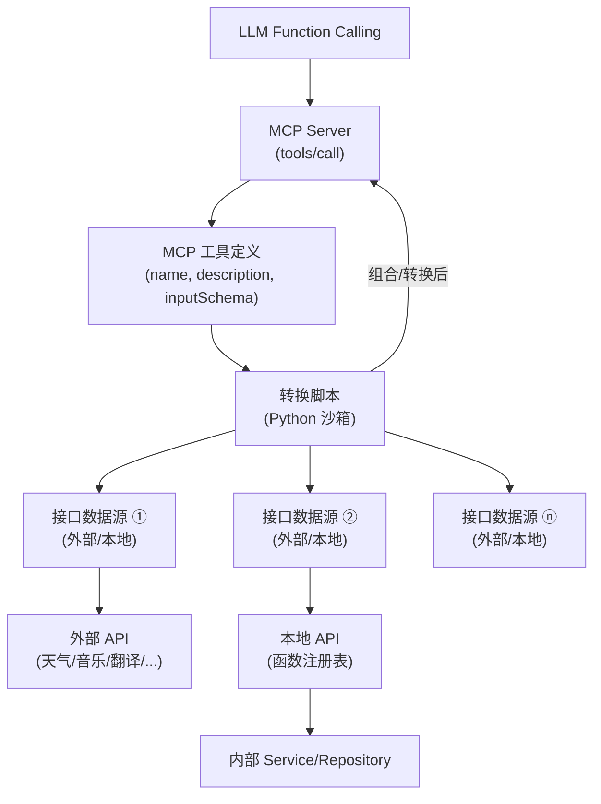

# 统一接口驱动架构重构方案 (Unified API-Driven Architecture)

> 文档日期: 2026-07-15  
> 目标版本: 待定（MRP 完成后确定）  
> 前置依赖: `docs/mcp_refactor_plan.md`（MRP）全部 Phase 完成后  
> 基于: DataFinderAgentOS v1.0.0-beta 当前代码  

---

## 〇、与 MRP 的关系

本文档是 `mcp_refactor_plan.md`（MRP）的**远期上层建筑**，不是替代方案。

| 维度 | MRP (待定) | 本文档 (待定) |
|------|-------------|-------------------|
| **核心目标** | MCP 工具数据库驱动 + 管理后台 + 员工权限 | 接口统一管理 + MCP 工具可配置脚本化 |
| **tool_type** | `builtin` / `api` / `crawl4ai` 三分类 | 新增 `script` 型，与现有三分类**共存** |
| **handler_module** | 保留，builtin 型核心机制 | 保留不动；`script` 型作为新增可选路径 |
| **builtin_tools/** | 按分类拆分为子包 | 保留不动；额外在 `api_interfaces` 中注册元数据 |
| **api_interfaces 表** | 不修改 | 新增 `interface_type`、`is_system`、`local_handler` 列 |
| **关系** | **先实施**，提供 MCP 基础设施 | **后实施**，基于 MRP 成果向上抽象 |

**实施原则**：MRP 全部 Phase 完成后，代码中已有完整的 MCP 工具注册表、管理后台和权限过滤。本文档在此基础上叠加「接口统一管理」和「脚本化工具」两层能力，**不推翻 MRP 的任何设计决策**。

---

## 一、重构动机

### 1.1 核心问题

当前架构存在两个分离的概念层级，导致概念重叠和维护困难：

| 当前概念 | 职责 | 问题 |
|----------|------|------|
| **MCP 工具** (`mcp_tools`) | 注册工具供 LLM 调用 | `builtin` 型直接调 Python 函数；`api` 型封装 HTTP 请求——两种形态混在一起 |
| **接口管理** (`api_interfaces`) | 管理可复用 HTTP 接口模板 | 仅服务 API 型数字员工，和 MCP 工具没有关联 |
| **内置工具** (`builtin_tools/`) | 实现具体功能的 Python 函数 | 部分工具（如音乐 `_get_random_music`）本质是对外部 HTTP API 的封装，但被标记为 `builtin` 型，管理员无法在界面查看/修改其调用的 API 地址 |

**本质矛盾**：音乐推荐（`api.injahow.cn`）、天气查询等本质就是「调 HTTP API 返回 JSON」。当前 `_get_random_music()` 代码中已是 HTTP 调用，但在数据库中被标为 `tool_type='builtin'`，管理员不可见其 API 地址。天气则做成了 API 型数字员工而非 MCP 工具，未被 LLM Function Calling 统一调度。

### 1.2 重构目标

```
         ┌─────────────────────────────────────┐
         │      MCP 工具（对 LLM 暴露的能力）      │
         │   = 接口数据源 × N + 自定义转换脚本     │
         └──────────────┬──────────────────────┘
                        │ 引用
         ┌──────────────▼──────────────────────┐
         │        接口管理（统一管理所有 API）       │
         │  ┌────────────┐  ┌────────────────┐  │
         │  │  外部接口    │  │   本地接口      │  │
         │  │ (可增删改)   │  │ (系统内置/只读) │  │
         │  └────────────┘  └────────────────┘  │
         └──────────────────────────────────────┘
```

**一句话总结**：MCP 工具不再内嵌调用逻辑，而是声明式地组合「接口数据源」+「自定义脚本」，接口管理统一管理所有外部和本地 API。

---

## 二、新架构总览

### 2.1 三层模型

```
┌──────────────────────────────────────────────────────────────────┐
│                     Layer 3: MCP 工具层                           │
│  对 LLM 暴露的 Function Calling 工具。                             │
│  每个工具 = [接口数据源 × 1..N] + 自定义转换脚本                    │
│  脚本可在管理界面自定义（Python 沙箱执行）                          │
├──────────────────────────────────────────────────────────────────┤
│                     Layer 2: 接口管理层                           │
│  统一管理所有 API 接口模板。                                       │
│  ┌─────────────────────┐  ┌──────────────────────────────┐       │
│  │ 外部接口 (external)   │  │ 本地接口 (local)              │       │
│  │ · 管理员可增删改      │  │ · 系统内置，不可删除/不可编辑  │       │
│  │ · 如: 天气API、       │  │ · is_system = 1              │       │
│  │   音乐API、翻译API    │  │ · 如: warehouse/search │       │
│  │ · is_system = 0      │  │        employee/list     │       │
│  └─────────────────────┘  └──────────────────────────────┘       │
├──────────────────────────────────────────────────────────────────┤
│                     Layer 1: 脚本执行引擎                         │
│  安全执行用户编写的 Python 转换脚本。                              │
│  · 输入: 接口返回的原始 JSON (data_sources)                       │
│  · 输出: MCP 工具调用的最终返回值                                 │
│  · 沙箱约束: 禁用 import / __builtins__ / 网络 / 文件系统          │
└──────────────────────────────────────────────────────────────────┘
```

### 2.2 数据流



### 2.3 调用流程详解

```
1. LLM 发起 Function Calling → tools/call { name: "get_weather", arguments: {city: "成都"} }
2. MCP Server 查找工具 "get_weather"
3. 工具配置:
   data_sources: [
     { interface_id: 1, param_mapping: { city: "city" } }  // 天气接口
   ]
   transform_script: |
     def transform(data_sources):
         weather = data_sources[0]
         return {
             "city": weather.get("city", ""),
             "temp": weather.get("temperature", "--") + "℃",
             "desc": weather.get("description", ""),
             "card": { "type": "weather", ... }
         }
4. 执行: 调用接口1 → 获取 JSON → 传入脚本 → 脚本处理 → 返回结果
5. 结果返回给 LLM
```

---

## 三、数据库变更方案

### 3.1 修改表: `api_interfaces` — 新增接口类型

```sql
-- 新增字段
ALTER TABLE api_interfaces ADD COLUMN interface_type TEXT DEFAULT 'external';
-- 'external' = 外部接口（管理员可增删改）
-- 'local'    = 本地接口（系统内置，不可修改/不可删除）

ALTER TABLE api_interfaces ADD COLUMN is_system INTEGER DEFAULT 0;
-- 1 = 系统内置，前端隐藏编辑/删除按钮

ALTER TABLE api_interfaces ADD COLUMN local_handler TEXT DEFAULT '';
-- 本地接口的内部处理器标识，如 'warehouse/search'
-- 仅 interface_type='local' 时有效
```

修改后 `api_interfaces` 表核心字段：

| 字段 | 类型 | 说明 |
|------|------|------|
| id | INTEGER PK | 主键 |
| name | TEXT UNIQUE | 接口名称 |
| description | TEXT | 描述 |
| **interface_type** | TEXT | `external` / `local` |
| **is_system** | INTEGER | 系统内置 (0/1)，local 型自动为 1 |
| **local_handler** | TEXT | 本地接口处理器路由 |
| api_url | TEXT | 外部接口 URL（external 型必填） |
| api_method | TEXT | HTTP 方法 |
| api_headers | TEXT | 请求头 JSON |
| api_params_template | TEXT | 参数模板 |
| response_render_template | TEXT | 响应渲染模板（可为空，由脚本替代） |
| api_secret | TEXT | 密钥(加密存储) |
| is_enabled | INTEGER | 启用状态 |
| sort_order | INTEGER | 排序 |

### 3.2 修改表: `mcp_tools` — 重构为接口组合模型

```sql
-- 新增字段
ALTER TABLE mcp_tools ADD COLUMN data_sources TEXT DEFAULT '[]';
-- JSON 数组，每个元素: { interface_id, param_mapping }
-- 例: [{"interface_id": 1, "param_mapping": {"city": "city"}}]

ALTER TABLE mcp_tools ADD COLUMN transform_script TEXT DEFAULT '';
-- 自定义 Python 转换脚本

ALTER TABLE mcp_tools ADD COLUMN script_enabled INTEGER DEFAULT 0;
-- 是否启用脚本转换（无脚本时直接透传第一个接口的返回）

-- 废弃字段（保留兼容读取）:
--   handler_module   → builtin 型不再使用，由 data_sources + transform_script 替代
--   api_url          → 迁移到 data_sources 引用的 api_interfaces
--   api_method       → 同上
--   api_headers      → 同上
--   api_params_template → 同上
--   tool_type        → 简化: 所有工具统一为 data_source 组合模式
```

修改后 `mcp_tools` 表核心字段：

| 字段 | 类型 | 说明 |
|------|------|------|
| id | INTEGER PK | 主键 |
| name | TEXT UNIQUE | 工具唯一标识 |
| display_name | TEXT | 显示名称 |
| description | TEXT | 工具描述（供 LLM 理解） |
| category | TEXT | 分类 |
| **tool_type** | TEXT | 保留 MRP 三分类 + 新增 `script` 型（共存） |
| **data_sources** | TEXT | JSON 数组：接口数据源配置 |
| **transform_script** | TEXT | 转换脚本（Python 代码） |
| **script_enabled** | INTEGER | 是否启用脚本 |
| input_schema | TEXT | JSON Schema 参数定义 |
| output_schema | TEXT | 输出 Schema |
| is_enabled | INTEGER | 启用/禁用 |
| is_system | INTEGER | 系统内置 |
| sort_order | INTEGER | 排序 |
| config | TEXT | 额外配置 JSON |

### 3.3 迁移策略

```
Phase 1 — 数据迁移（注意 SQLite 限制）:
  1. 备份 api_interfaces 表: api_url 列当前为 TEXT NOT NULL，需要改为 TEXT DEFAULT ''
     （SQLite 不支持 ALTER COLUMN，需建新表→迁移数据→删旧表→重命名，务必在同一事务中完成）
  2. 新增 interface_type / is_system / local_handler 列
  3. 为每个 builtin MCP 工具创建对应的 local 接口记录 (api_url 填 'local://')
  4. 现有 external API 接口: 回填 interface_type='external'
  5. mcp_tools 新增 data_sources / transform_script / script_enabled 列
  6. 为 script 型工具填充 data_sources（引用步骤3创建的接口）
  7. 音乐/天气等: 在 api_interfaces 中创建 external 记录 → mcp_tools 中创建 script 型工具

Phase 2 — 代码重构:
  1. 实现 local_api_client.py（函数注册表直调模式，非 HTTP 路由）
  2. 实现 script_engine.py（AST 白名单沙箱）
  3. 改造 registry.py：新增 script 型 _build_tool_from_db_row 分支（与 builtin/api 分支共存）

Phase 3 — 前端适配:
  1. 接口管理列表区分 external / local 标签
  2. local 接口隐藏编辑/删除按钮
  3. MCP 工具编辑页: 数据源选择器 + 脚本编辑器
```

---

## 四、本地接口层设计（函数注册表模式）

### 4.1 设计原则

> ⚠️ **关键决策**: 本地接口**不作为 HTTP Handler 注册**。原因：
> 1. Tornado Handler 依赖完整 HTTP 请求上下文（`self.request`、`self.current_user`），无法在 MCP 工具调用链路（普通用户上下文）中直接实例化
> 2. `AdminBaseHandler.prepare()` 校验管理员权限——普通用户的 MCP 工具调用会被拒绝
> 3. 注册为 HTTP 端点会暴露攻击面（任何人都可 HTTP 访问）

采用**函数注册表直调**模式：

- `builtin_tools/` 中的 Python 函数保持不变（MRP 架构不动）
- 额外维护一个 `_LOCAL_HANDLER_MAP` 字典，映射 `local_handler` 字符串 → 实际函数
- `api_interfaces` 表中的 `local` 型记录仅存储**元数据**（名称、描述、参数模板），`local_handler` 字段指向函数注册表中的键
- 调用时通过 `local_api_client.py` 查表直调，零网络开销
- `api_url` 列对 local 型填 `local://` 占位（迁移时需将 `api_url` 从 `NOT NULL` 改为 `DEFAULT ''`）

### 4.2 本地接口清单

本地接口的 `local_handler` 标识对应 `builtin_tools/` 中已有的函数：

| 分类 | local_handler | 对应 builtin 函数 |
|------|--------------|-------------------|
| 🔍 数据仓库 | `warehouse/search` | `warehouse_tools._search_warehouse` |
| 🔍 数据仓库 | `warehouse/recent` | `warehouse_tools._get_recent_warehouse_data` |
| 🔍 数据仓库 | `warehouse/stats` | `warehouse_tools._get_warehouse_stats` |
| 🔍 数据仓库 | `warehouse/fulltext` | `warehouse_tools._search_warehouse_fulltext` |
| 🔍 数据仓库 | `warehouse/by_id` | `warehouse_tools._get_warehouse_by_id` |
| 🔭 瞭望采集 | `collect/web` | `collect_tools._collect_web_data` |
| 🔭 瞭望采集 | `collect/deep` | `collect_tools._deep_collect_url` |
| 🔭 瞭望采集 | `collect/sources` | `collect_tools._list_watch_sources` |
| 🤖 数字员工 | `employee/list` | `employee_tools._list_digital_employees` |
| 🤖 数字员工 | `employee/invoke` | `employee_tools._invoke_digital_employee` |
| 🧠 AI 模型 | `model/list` | `model_tools._list_ai_models` |
| 🧠 AI 模型 | `model/default` | `model_tools._get_default_model` |
| 💬 对话管理 | `conversation/list` | `chat_tools._list_conversations` |
| 💬 对话管理 | `conversation/messages` | `chat_tools._get_conversation_messages` |
| 🕷️ 爬虫增强 | `crawl4ai/collect` | `crawl4ai_tools._collect_with_crawl4ai` |
| 🕷️ 爬虫增强 | `crawl4ai/batch` | `crawl4ai_tools._batch_deep_collect` |
| 🔧 系统管理 | `system/stats` | `system_tools._get_system_stats` |
| 🔧 系统管理 | `skill/load` | `system_tools._load_skill` |

### 4.3 函数注册表 + 本地接口客户端

```python
# app/services/local_api_client.py (新文件)
"""本地接口进程内调用客户端 — 基于函数注册表，零网络开销。"""

import asyncio
import logging
from typing import Any, Callable, Dict

logger = logging.getLogger(__name__)

# 函数注册表: local_handler → (sync_func, is_async)
_LOCAL_HANDLER_MAP: Dict[str, Callable] = {}


def register_local_handler(handler_key: str, func: Callable):
    """注册本地接口处理函数。"""
    _LOCAL_HANDLER_MAP[handler_key] = func
    logger.info(f"注册本地接口: {handler_key}")


def _init_local_handlers():
    """系统启动时自动注册所有本地接口处理函数。
    复用 builtin_tools/ 中已有的函数，不做任何重构。"""
    from app.mcp.builtin_tools.warehouse_tools import (
        _search_warehouse, _get_recent_warehouse_data, _get_warehouse_stats,
        _search_warehouse_fulltext, _get_warehouse_by_id,
    )
    from app.mcp.builtin_tools.collect_tools import (
        _collect_web_data, _deep_collect_url, _list_watch_sources,
    )
    from app.mcp.builtin_tools.employee_tools import (
        _list_digital_employees, _invoke_digital_employee,
    )
    from app.mcp.builtin_tools.model_tools import (
        _list_ai_models, _get_default_model,
    )
    from app.mcp.builtin_tools.chat_tools import (
        _list_conversations, _get_conversation_messages,
    )
    from app.mcp.builtin_tools.crawl4ai_tools import (
        _collect_with_crawl4ai, _batch_deep_collect,
    )
    from app.mcp.builtin_tools.system_tools import (
        _load_skill, _get_system_stats,
    )

    register_local_handler("warehouse/search", _search_warehouse)
    register_local_handler("warehouse/recent", _get_recent_warehouse_data)
    register_local_handler("warehouse/stats", _get_warehouse_stats)
    register_local_handler("warehouse/fulltext", _search_warehouse_fulltext)
    register_local_handler("warehouse/by_id", _get_warehouse_by_id)
    register_local_handler("collect/web", _collect_web_data)
    register_local_handler("collect/deep", _deep_collect_url)
    register_local_handler("collect/sources", _list_watch_sources)
    register_local_handler("employee/list", _list_digital_employees)
    register_local_handler("employee/invoke", _invoke_digital_employee)
    register_local_handler("model/list", _list_ai_models)
    register_local_handler("model/default", _get_default_model)
    register_local_handler("conversation/list", _list_conversations)
    register_local_handler("conversation/messages", _get_conversation_messages)
    register_local_handler("crawl4ai/collect", _collect_with_crawl4ai)
    register_local_handler("crawl4ai/batch", _batch_deep_collect)
    register_local_handler("system/stats", _get_system_stats)
    register_local_handler("skill/load", _load_skill)


async def call_local_api(handler_key: str, params: Dict[str, Any]) -> Dict[str, Any]:
    """调用本地接口（进程内函数直调）。

    支持同步和异步函数。对于同步函数，在线程池中执行以避免阻塞 IOLoop。
    """
    func = _LOCAL_HANDLER_MAP.get(handler_key)
    if not func:
        return {"success": False, "error": f"未注册的本地接口: {handler_key}"}

    import concurrent.futures
    loop = asyncio.get_event_loop()

    try:
        result = func(**params)
        if asyncio.iscoroutine(result):
            result = await result
        # 对于同步但涉及 I/O 的函数（如 _collect_web_data），在线程池中包装
        # 实际由 builtin_tools 内部的 run_in_executor 处理
        return {"success": True, "data": result}
    except Exception as e:
        logger.error(f"本地接口 {handler_key} 调用失败: {e}", exc_info=True)
        return {"success": False, "error": str(e)}
```

### 4.4 本地接口元数据自动同步

```python
# app/services/local_api_registry.py (新文件)
"""系统启动时同步本地接口元数据到 api_interfaces 表。"""

LOCAL_API_SEEDS = [
    {
        "name": "数据仓库搜索",
        "description": "在数据仓库中搜索关键词相关内容",
        "interface_type": "local",
        "is_system": 1,
        "local_handler": "warehouse/search",
        "api_method": "GET",
        "api_params_template": '{"keyword": "{{keyword}}", "limit": 10}',
    },
    # ... 其余 17 个接口种子数据
]


def sync_local_api_interfaces():
    """同步本地接口到 api_interfaces 表。
    - local 型记录的 api_url 填 'local://'
    - is_system=1，前端隐藏编辑/删除按钮
    - 已存在则更新元数据，不存在则 INSERT
    """
    from app.models.db import get_db

    with get_db() as conn:
        for seed in LOCAL_API_SEEDS:
            existing = conn.execute(
                "SELECT id FROM api_interfaces WHERE name = ?", (seed["name"],)
            ).fetchone()
            if existing:
                conn.execute(
                    "UPDATE api_interfaces SET description=?, interface_type=?, "
                    "is_system=?, local_handler=?, api_method=?, api_params_template=? "
                    "WHERE id=? AND is_system=1",
                    (seed["description"], seed["interface_type"], seed["is_system"],
                     seed["local_handler"], seed["api_method"],
                     seed["api_params_template"], existing["id"]),
                )
            else:
                conn.execute(
                    "INSERT INTO api_interfaces (name, description, interface_type, "
                    "is_system, local_handler, api_url, api_method, "
                    "api_params_template, is_enabled, sort_order) "
                    "VALUES (?, ?, ?, ?, ?, 'local://', ?, ?, 1, 0)",
                    (seed["name"], seed["description"], seed["interface_type"],
                     seed["is_system"], seed["local_handler"],
                     seed["api_method"], seed["api_params_template"]),
                )
        conn.commit()
```

---

## 五、脚本执行引擎设计

### 5.1 设计目标

- 管理员在 MCP 工具编辑页编写 Python 转换脚本
- 脚本接收接口返回的原始数据，输出转换后结果
- **安全沙箱**：基于 AST 白名单遍历 + 受限内置函数，防止恶意代码
- 生产环境推荐使用 `RestrictedPython` 库；开发阶段可用 AST 白名单作为轻量替代
- 执行超时保护（signal.alarm + 递归深度限制）

### 5.2 安全策略：AST 白名单（替换关键词黑名单）

> ⚠️ **为什么不用关键词黑名单**: `.lower()` 字符串匹配可被 Unicode 同形字（全角字符）、
> 零宽字符、`chr()` 拼接、`getattr(__builtins__, '__im' + 'port__')` 等无数方式绕过。
> 必须基于**语法树（AST）**做结构级校验。

**AST 白名单允许的节点类型**（仅数据转换所需的最小集合）：

```python
_ALLOWED_NODES = {
    ast.Module, ast.FunctionDef, ast.Return,
    ast.Expr, ast.Call, ast.Name, ast.Load, ast.Store,
    ast.Constant, ast.Dict, ast.List, ast.Tuple, ast.Set,
    ast.DictComp, ast.ListComp, ast.Subscript, ast.Slice,
    ast.If, ast.IfExp, ast.For, ast.While, ast.Break, ast.Continue,
    ast.BinOp, ast.UnaryOp, ast.BoolOp, ast.Compare,
    ast.Attribute, ast.keyword, ast.arg, ast.arguments,
    ast.Assign, ast.AugAssign, ast.Pass,
    ast.Import, ast.ImportFrom,  # 允许但限制模块名
    ast.JoinedStr, ast.FormattedValue,  # f-string
}
```

**严格禁止**：
- `ast.Call` 中调用 `exec`/`eval`/`open`/`getattr`/`setattr`/`__import__`
- 任何 `ast.Attribute` 链上访问 `__class__`/`__bases__`/`__subclasses__`/`__globals__`/`__code__`/`__closure__`
- `ast.Import` / `ast.ImportFrom` 中非白名单模块名（仅允许 `json`, `random`, `datetime`, `re`, `math`, `itertools`）

### 5.2 脚本接口规范

```python
# 脚本必须定义 transform 函数
# 输入: data_sources — list[dict], 按 data_sources 配置顺序传入每个接口的返回 JSON
# 输出: dict — MCP 工具调用的最终返回值

def transform(data_sources):
    """
    Args:
        data_sources: [
            { "success": True, "data": {...} },   # 接口1返回
            { "success": True, "data": {...} },   # 接口2返回 (如有)
        ]
    Returns:
        dict: 返回给 LLM 的结果
    """
    # 用户在此编写转换逻辑
    pass
```

### 5.3 脚本执行器（AST 白名单版）

```python
# app/services/script_engine.py (新文件)
"""安全的 Python 脚本执行沙箱 — 基于 AST 白名单。"""

import ast
import json as _json
import logging
import sys
import signal
from typing import Any, Dict, Tuple

logger = logging.getLogger(__name__)

# ═══════════════════════════════════════════════════════════
# 允许的内置函数（数据转换最小集合）
# ═══════════════════════════════════════════════════════════
_SAFE_BUILTINS = {
    # 基础
    "True": True, "False": False, "None": None,
    # 类型转换
    "int": int, "float": float, "str": str, "bool": bool,
    "list": list, "dict": dict, "tuple": tuple, "set": set,
    # 集合操作
    "len": len, "range": range, "enumerate": enumerate, "zip": zip,
    "map": map, "filter": filter, "sorted": sorted, "reversed": reversed,
    "min": min, "max": max, "sum": sum, "abs": abs, "round": round,
    "any": any, "all": all, "isinstance": isinstance, "type": type,
    # 字符串
    "format": format, "repr": repr,
    # 输出 (禁止)
    "print": lambda *a, **kw: None,
    # 模块白名单
    "json": _json,
    # 危险函数 → None（覆盖禁止）
    "__import__": None, "exec": None, "eval": None,
    "open": None, "compile": None, "globals": None, "locals": None,
    "getattr": None, "setattr": None, "delattr": None,
    "__builtins__": None, "__build_class__": None,
}

# ═══════════════════════════════════════════════════════════
# AST 白名单 + 安全校验
# ═══════════════════════════════════════════════════════════
_ALLOWED_NODE_TYPES = {
    ast.Module, ast.FunctionDef, ast.Return,
    ast.Expr, ast.Call, ast.Name, ast.Load, ast.Store, ast.Del,
    ast.Constant, ast.Dict, ast.List, ast.Tuple, ast.Set,
    ast.DictComp, ast.ListComp,
    ast.Subscript, ast.Slice, ast.Index,
    ast.If, ast.IfExp, ast.For, ast.Break, ast.Continue,
    ast.BinOp, ast.UnaryOp, ast.BoolOp, ast.Compare,
    ast.Attribute, ast.keyword, ast.arg, ast.arguments,
    ast.Assign, ast.AugAssign, ast.Pass,
    ast.JoinedStr, ast.FormattedValue,
    ast.And, ast.Or, ast.Add, ast.Sub, ast.Mult, ast.Div, ast.Mod,
    ast.Pow, ast.FloorDiv, ast.LShift, ast.RShift, ast.BitOr,
    ast.BitXor, ast.BitAnd, ast.MatMult,
    ast.Eq, ast.NotEq, ast.Lt, ast.LtE, ast.Gt, ast.GtE,
    ast.Is, ast.IsNot, ast.In, ast.NotIn,
    ast.Not, ast.Invert, ast.UAdd, ast.USub,
}

_ALLOWED_IMPORT_MODULES = {"json", "random", "re", "math", "datetime", "itertools"}

_FORBIDDEN_ATTR_NAMES = {
    "__class__", "__bases__", "__subclasses__", "__mro__",
    "__globals__", "__code__", "__closure__", "__func__", "__self__",
    "__builtins__", "__builtin__", "__import__",
}
_FORBIDDEN_CALL_NAMES = {
    "exec", "eval", "open", "compile", "globals", "locals",
    "getattr", "setattr", "delattr", "__import__",
}


class ScriptSecurityError(Exception):
    """脚本安全检查未通过。"""
    pass


def _check_ast_node(node: ast.AST):
    """递归遍历 AST 节点，检查是否在白名单内。"""
    # 检查节点类型
    if type(node) not in _ALLOWED_NODE_TYPES:
        raise ScriptSecurityError(
            f"不允许的语法节点: {type(node).__name__} (行 {getattr(node, 'lineno', '?')})"
        )

    # 检查 Import / ImportFrom
    if isinstance(node, ast.Import):
        for alias in node.names:
            if alias.name.split(".")[0] not in _ALLOWED_IMPORT_MODULES:
                raise ScriptSecurityError(f"不允许导入模块: {alias.name}")
    if isinstance(node, ast.ImportFrom):
        if node.module and node.module.split(".")[0] not in _ALLOWED_IMPORT_MODULES:
            raise ScriptSecurityError(f"不允许导入模块: {node.module}")

    # 检查 Call — 禁止调用 exec/eval/open 等
    if isinstance(node, ast.Call):
        if isinstance(node.func, ast.Name):
            if node.func.id in _FORBIDDEN_CALL_NAMES:
                raise ScriptSecurityError(f"不允许调用函数: {node.func.id}")
        elif isinstance(node.func, ast.Attribute):
            if node.func.attr in _FORBIDDEN_CALL_NAMES:
                raise ScriptSecurityError(f"不允许调用方法: {node.func.attr}")

    # 检查 Attribute — 禁止访问危险属性
    if isinstance(node, ast.Attribute):
        if node.attr in _FORBIDDEN_ATTR_NAMES:
            raise ScriptSecurityError(f"不允许访问属性: {node.attr}")

    # 递归检查所有子节点
    for child in ast.iter_child_nodes(node):
        _check_ast_node(child)


def validate_script(script: str) -> Tuple[bool, str]:
    """预检脚本安全性（AST 级）。返回 (is_safe, error_message)。"""
    if not script or not script.strip():
        return True, ""

    # 1. 语法检查
    try:
        tree = ast.parse(script, filename="<script>")
    except SyntaxError as e:
        return False, f"脚本语法错误: 行 {e.lineno} — {e.msg}"

    # 2. AST 白名单遍历
    try:
        _check_ast_node(tree)
    except ScriptSecurityError as e:
        return False, str(e)

    # 3. 检查必须定义 transform 函数
    has_transform = any(
        isinstance(node, ast.FunctionDef) and node.name == "transform"
        for node in ast.walk(tree)
    )
    if not has_transform:
        return False, "脚本必须定义 transform(data_sources) 函数"

    return True, ""


def execute_transform_script(script: str, data_sources: list,
                             timeout: float = 5.0) -> dict:
    """在受限环境中执行转换脚本。

    Args:
        script: Python 脚本字符串
        data_sources: 接口数据源返回列表
        timeout: 最大执行时间（秒），默认 5s

    Returns:
        转换后的结果 dict
    """
    is_safe, error = validate_script(script)
    if not is_safe:
        return {"success": False, "error": f"脚本验证失败: {error}"}

    # 递归深度限制
    sys.setrecursionlimit(500)

    try:
        # 创建受限全局命名空间
        restricted_globals = dict(_SAFE_BUILTINS)

        # 执行脚本定义 transform 函数
        compiled = compile(script, "<script>", "exec")
        exec(compiled, restricted_globals)

        # 获取 transform 函数
        transform_func = restricted_globals.get("transform")
        if not callable(transform_func):
            return {"success": False, "error": "脚本未定义有效的 transform 函数"}

        # 调用 transform（带超时）
        def _run():
            return transform_func(data_sources)

        # 信号超时（仅 Unix；Windows 使用 threading.Timer 回退）
        if hasattr(signal, "SIGALRM"):
            old_handler = signal.signal(signal.SIGALRM, lambda *_: (_ for _ in ()).throw(TimeoutError("脚本执行超时")))
            signal.setitimer(signal.ITIMER_REAL, timeout)
            try:
                result = _run()
            finally:
                signal.setitimer(signal.ITIMER_REAL, 0)
                signal.signal(signal.SIGALRM, old_handler)
        else:
            result = _run()

        # 确保返回 dict
        if not isinstance(result, dict):
            result = {"success": True, "data": result}

        return result

    except TimeoutError:
        return {"success": False, "error": f"脚本执行超时（>{timeout}秒）"}
    except Exception as e:
        logger.error(f"脚本执行失败: {e}", exc_info=True)
        return {"success": False, "error": f"脚本执行错误: {str(e)}"}
```

> **生产环境推荐**: 上述 AST 白名单是轻量方案。如果需要更高安全级别，建议引入
> [`RestrictedPython`](https://pypi.org/project/RestrictedPython/) 库，它提供了成熟的
> Python 代码安全编译和受限执行能力。替换时仅需更改 `validate_script` 中的编译步骤，
> 其余 `execute_transform_script` 逻辑保持不变。

### 5.4 脚本示例

#### 示例 1: 天气工具（单个外部接口 + 格式化脚本）

```python
# 接口: 天气 API (external, GET https://api.weather.com/v1/current)
# 脚本:
def transform(data_sources):
    weather = data_sources[0]
    current = weather.get("data", {}).get("current", {})
    return {
        "success": True,
        "city": current.get("city", "未知"),
        "temperature": str(current.get("temp", "--")) + "℃",
        "humidity": str(current.get("humidity", "--")) + "%",
        "description": current.get("desc", ""),
        "wind": current.get("wind", ""),
        "card": {
            "type": "weather",
            "title": str(current.get("city", "")) + " 天气",
            "content": "温度 " + str(current.get("temp", "--")) + "℃ | 湿度 "
                       + str(current.get("humidity", "--")) + "%",
        }
    }
```

#### 示例 2: 数据仓库概览（多个本地接口 + 组合脚本）

```python
# data_sources: [仓库统计接口, 最新数据接口]
# 脚本:
def transform(data_sources):
    stats = data_sources[0].get("data", {})
    recent = data_sources[1].get("data", {}).get("items", [])

    return {
        "success": True,
        "overview": {
            "total_records": stats.get("total", 0),
            "deep_collected": stats.get("deep_collected", 0),
            "top_sources": stats.get("top_sources", [])[:5],
        },
        "recent_items": [
            {"title": item.get("title", ""), "source": item.get("source_name", "")}
            for item in recent[:5]
        ],
    }
```

#### 示例 3: 随机音乐（外部接口 + 抽选脚本）

```python
# 接口: 网易云热歌榜 API (external)
# random 在 AST 白名单允许导入模块中
import random

def transform(data_sources):
    songs = data_sources[0]

    if isinstance(songs, list) and len(songs) > 0:
        song = random.choice(songs)
        return {
            "success": True,
            "name": song.get("name", ""),
            "artist": song.get("artist", ""),
            "cover": song.get("pic", ""),
            "url": song.get("url", ""),
            "source": "网易云音乐热歌榜",
        }

    return {"success": False, "error": "歌曲列表为空"}
```

---

## 六、MCP 工具注册中心改造

### 6.1 新旧对比

| 维度 | 旧架构 (v0.10, MRP 保持) | 新增能力 |
|------|--------------------------|-------------------|
| 工具类型 | `builtin` / `api` / `crawl4ai` | 新增 `script` 型（与三种旧类型**共存**） |
| builtin 型 | Python 函数指针 (`handler_module`) → importlib 加载 | **保持不动** |
| api 型 | `api_url` + `api_headers` → HTTP 调用 | **保持不动** |
| script 型 | 不存在 | `data_sources`（引用 api_interfaces）+ `transform_script` |
| 音乐工具 | `builtin` 型（代码中对 `api.injahow.cn` 做 HTTP 调用） | 可选新增 script 型版本（external 接口 + 抽选脚本），与 builtin 版共存 |
| 天气工具 | API 型数字员工 | 可选新增 script 型 MCP 工具（external 接口 + 格式化脚本） |
| 注册方式 | MRP 统一的 `_build_tool_from_db_row` → 按 tool_type 分支 | 新增 `script` 分支 |
| 热重载 | 重新读数据库 + importlib | script 型仅需重新读数据库 |

### 6.2 新 Registry — `_build_tool_from_db_row()` 增加 `script` 分支

```python
# app/mcp/registry.py — 在现有 _build_tool_from_db_row 中新增 script 分支

def _build_tool_from_db_row(row: Dict[str, Any]) -> Optional[MCPTool]:
    """从数据库行构建 MCPTool。新增 script 型分支。"""
    import json

    tool_type = row.get("tool_type", "builtin")

    # ── 新增分支: script 型 ──
    if tool_type == "script":
        return _build_script_tool(row)

    # ── 以下为 MRP 原有逻辑（保持不变）──
    if tool_type == "builtin":
        return _build_builtin_tool(row)       # handler_module + importlib
    elif tool_type == "api":
        return _build_api_tool(row)            # api_url + urllib
    elif tool_type == "crawl4ai":
        return _build_crawl4ai_tool(row)

    return None


def _build_script_tool(row: Dict[str, Any]) -> Optional[MCPTool]:
    """构建 script 型工具: 接口数据源 + 转换脚本。"""
    import json
    import asyncio
    from app.models.api_interface import ApiInterfaceRepository
    from app.services.script_engine import execute_transform_script
    from app.services.local_api_client import call_local_api
    from app.utils.safe_http import safe_http_request

    try:
        input_schema = json.loads(row.get("input_schema", "{}"))
        data_sources = json.loads(row.get("data_sources", "[]"))
    except (json.JSONDecodeError, TypeError):
        input_schema = {}
        data_sources = []

    transform_script = row.get("transform_script", "")
    script_enabled = bool(row.get("script_enabled", 0))

    if not data_sources:
        logger.warning(f"script 型工具 {row['name']} 未配置 data_sources")
        return None

    async def script_handler(**kwargs) -> Any:
        """script 型统一处理器: 调用接口 → 脚本转换 → 返回。"""
        import concurrent.futures
        loop = asyncio.get_event_loop()

        # 1. 逐个调用数据源接口
        results = []
        for ds in data_sources:
            interface_id = ds.get("interface_id")
            param_mapping = ds.get("param_mapping", {})

            iface = ApiInterfaceRepository.get_by_id(interface_id)
            if not iface:
                results.append({"success": False, "error": f"接口 {interface_id} 不存在"})
                continue

            # 映射参数: tool参数名 → 接口参数名
            mapped_params = {}
            for tool_param, iface_param in param_mapping.items():
                if tool_param in kwargs:
                    mapped_params[iface_param] = kwargs[tool_param]
            # 注入上下文变量 ($ctx.*)
            mapped_params = _inject_context_params(mapped_params)

            # 调用接口
            if iface.get("interface_type") == "local":
                # 进程内函数直调（local_api_client.py）
                result = await call_local_api(
                    iface["local_handler"], mapped_params
                )
            else:
                # 外部 HTTP 调用 — 必须在线程池中执行
                iface_copy = dict(iface)
                result = await loop.run_in_executor(
                    None, lambda: _call_external_api_sync(iface_copy, mapped_params)
                )

            results.append(result)

        # 2. 如果启用脚本，执行转换
        if script_enabled and transform_script.strip():
            return execute_transform_script(transform_script, results)

        # 3. 无脚本时，直接透传第一个数据源的结果
        return results[0] if results else {"success": False, "error": "无数据"}

    return MCPTool(
        name=row["name"],
        description=row.get("description", ""),
        input_schema=input_schema,
        handler=script_handler,
    )


def _inject_context_params(params: dict) -> dict:
    """注入上下文变量。将 $ctx.username 等占位符替换为当前会话上下文值。"""
    from app.mcp.client import _mcp_context_var
    ctx = _mcp_context_var.get() or {}
    resolved = {}
    for key, value in params.items():
        if isinstance(value, str) and value.startswith("$ctx."):
            ctx_key = value[5:]  # 去掉 '$ctx.' 前缀
            resolved[key] = ctx.get(ctx_key, "")
        else:
            resolved[key] = value
    return resolved


def _call_external_api_sync(iface: dict, params: dict) -> dict:
    """同步调用外部 HTTP API（在线程池中执行，不阻塞 IOLoop）。"""
    from app.utils.safe_http import safe_http_request
    import json as _json
    try:
        status, body = safe_http_request(
            url=iface["api_url"],
            method=iface.get("api_method", "GET"),
            headers=_json.loads(iface.get("api_headers", "{}")),
            params=params,
            timeout=30,
        )
        try:
            return {"success": True, "data": _json.loads(body)}
        except _json.JSONDecodeError:
            return {"success": True, "data": {"raw": body[:5000]}}
    except Exception as e:
        return {"success": False, "error": str(e)}
```

### 6.3 本地接口调用客户端

已在 §4.3 中完整定义。`call_local_api(handler_key, params)` 基于 `_LOCAL_HANDLER_MAP` 函数注册表，
通过进程内函数直调实现，零网络开销。`handler_key` 对应 `api_interfaces.local_handler` 字段。
详细代码见 §4.3。

---

## 七、前端管理界面设计

### 7.1 接口管理列表页 — 增加类型区分

```
┌──────────────────────────────────────────────────────────────────┐
│  🔌 接口管理                                    [+ 新增外部接口]   │
├──────────────────────────────────────────────────────────────────┤
│  [全部] [外部接口] [本地接口]  🔍 搜索...                       │
├──────────────────────────────────────────────────────────────────┤
│  ┌────────────────────────────────────────────────────────────┐   │
│  │ 🌐 天气查询接口                                    [外部] │   │
│  │ 查询指定城市的实时天气信息                                   │   │
│  │ GET https://api.weather.com/v1/current                    │   │
│  │ [✏️编辑] [🧪测试] [⏸禁用] [🗑删除]                          │   │
│  └────────────────────────────────────────────────────────────┘   │
│  ┌────────────────────────────────────────────────────────────┐   │
│  │ 🏠 数据仓库搜索                                    [本地] │   │  ← 无编辑/删除按钮
│  │ 在数据仓库中搜索关键词相关内容                                │   │
│  │ 函数: warehouse/search (进程内直调)                         │   │
│  │ [🧪测试] [⏸禁用]                           🔒 系统内置      │   │
│  └────────────────────────────────────────────────────────────┘   │
│  ┌────────────────────────────────────────────────────────────┐   │
│  │ 🏠 数字员工列表                                    [本地] │   │
│  │ 列出所有启用的数字员工                                       │   │
│  │ 函数: employee/list (进程内直调)                            │   │
│  │ [🧪测试] [⏸禁用]                           🔒 系统内置      │   │
│  └────────────────────────────────────────────────────────────┘   │
└──────────────────────────────────────────────────────────────────┘
```

### 7.2 MCP 工具编辑页 — 数据源配置 + 脚本编辑器

```
┌──────────────────────────────────────────────────────────────────┐
│  ✏️ 编辑 MCP 工具: get_weather                                  │
├──────────────────────────────────────────────────────────────────┤
│  名称:        [get_weather____________]                           │
│  显示名称:    [天气查询_______________]                            │
│  描述:        [查询指定城市的实时天气信息_________________________]  │
│  分类:        [🎵 娱乐 ▼]                                        │
│                                                                  │
│  ── 数据源配置 ──────────────────────────────────────            │
│  ┌─────────────────────────────────────────────────────┐         │
│  │ 数据源 #1                                    [✕ 删除] │         │
│  │ 接口:  [天气查询接口 (external) ▼]                    │         │
│  │ 参数映射:                                              │         │
│  │   工具参数 city  →  接口参数 city                     │         │
│  │   [+ 添加映射]                                        │         │
│  └─────────────────────────────────────────────────────┘         │
│  ┌─────────────────────────────────────────────────────┐         │
│  │ 数据源 #2                                    [✕ 删除] │         │
│  │ 接口:  [数据仓库搜索 (local) ▼]                       │         │
│  │ 参数映射:                                              │         │
│  │   工具参数 keyword  →  接口参数 keyword               │         │
│  └─────────────────────────────────────────────────────┘         │
│  [+ 添加数据源]                                                  │
│                                                                  │
│  ── 转换脚本 ────────────────────────────────────────            │
│  ☑ 启用自定义转换脚本                                            │
│  ┌─────────────────────────────────────────────────────┐         │
│  │ def transform(data_sources):                         │         │
│  │     weather = data_sources[0]                        │         │
│  │     return {                                         │         │
│  │         "city": weather["data"]["city"],             │         │
│  │         "temp": str(weather["data"]["temp"]) + "℃", │         │
│  │     }                                                │         │
│  └─────────────────────────────────────────────────────┘         │
│  [🧪 测试脚本]  [📋 脚本模板]                                    │
│                                                                  │
│  ── 参数 Schema ─────────────────────────────────────            │
│  { "type": "object", "properties": { "city": {"type": "string"} }│
│                                                                  │
│  [💾 保存]  [🧪 在线测试]  [↩ 返回]                              │
└──────────────────────────────────────────────────────────────────┘
```

### 7.3 接口管理编辑页 — 增加本地接口只读视图

```
┌──────────────────────────────────────────────────────────────────┐
│  🔒 查看本地接口: 数据仓库搜索 (系统内置，不可编辑)                │
├──────────────────────────────────────────────────────────────────┤
│  名称:        数据仓库搜索                                        │
│  描述:        在数据仓库中搜索关键词相关内容                        │
│  类型:        🏠 本地接口 (系统内置)                              │
│  处理器:      warehouse/search (进程内函数直调)                   │
│  参数模板:    { "keyword": "{{keyword}}", "limit": 10 }         │
│                                                                  │
│  ⚠️ 此为系统内置本地接口，不可修改。如需自定义行为，请在此基础上   │
│     创建 MCP 工具（script 型）并使用转换脚本。                     │
│                                                                  │
│  [🧪 测试]  [↩ 返回]                                            │
└──────────────────────────────────────────────────────────────────┘
```

---

## 八、文件变更清单

### 8.1 新建文件

```
finderos/app/
├── services/
│   ├── script_engine.py            # 脚本执行沙箱引擎（AST 白名单）
│   ├── local_api_client.py         # 本地接口函数注册表 + 进程内调用
│   └── local_api_registry.py       # 本地接口元数据自动同步到 api_interfaces
├── templates/admin/
│   └── script_templates.html       # 脚本模板片段
└── static/js/
    └── mcp_script_editor.js        # 脚本编辑器前端（语法高亮、自动补全、测试）

finderos/docs/
└── unified_api_architecture.md     # 本文档
```

### 8.2 修改文件

```
✏️ app/models/db.py                 # api_interfaces: 加 interface_type/is_system/local_handler 列
                                    #   （注意: api_url 从 NOT NULL 改为 DEFAULT ''）
                                    # mcp_tools: 加 data_sources/transform_script/script_enabled 列
✏️ app/models/api_interface.py     # 新增 interface_type 字段 CRUD；validate_api_url_template
                                    #   支持 'local://' 协议
✏️ app/models/mcp_tool.py          # 新增 data_sources/transform_script/script_enabled CRUD
✏️ app/mcp/registry.py             # _build_tool_from_db_row(): 新增 script 型分支
                                    #   builtin/api/crawl4ai 分支保持不变（MRP 兼容）
✏️ app/controllers/admin_interface.py  # 列表: interface_type 列 + 外部/本地 Tab
                                    # 表单: local 型只读视图
✏️ app/controllers/admin_mcp.py    # 表单: tool_type 下拉增加 'script' 选项
                                    # 条件显示 data_sources 配置区 + 脚本编辑器
✏️ app/templates/admin/interface_list.html    # 区分 external/local 标签
✏️ app/templates/admin/interface_form.html    # local 型只读视图
✏️ app/templates/admin/mcp_tool_form.html     # 数据源选择器 + 脚本编辑器（script 型时显示）
✏️ main.py                         # 无需注册 /api/local/* 路由（本地接口不走 HTTP）
✏️ migrate_db.py                   # 迁移脚本（含 api_url 约束放宽）
✏️ seed data (db.py)               # 初始化本地接口种子数据 + script 型工具示例
```


---

## 九、关键集成点适配

### 9.1 user_chat.py — SSE 流式对话适配

`user_chat.py` 有两条 MCP 调用路径，script 型工具无需特殊适配即可正常工作：

| 路径 | 当前行为 | script 型兼容性 |
|------|---------|----------------|
| **路径 A**: `_chat_with_llm_tools()` | LLM Function Calling → `MCPClient.get_openai_tools()` → 多轮 tool_calls | ✅ 兼容。`MCPTool.call()` 对 script 型的 `script_handler` 与 builtin 型行为一致 |
| **路径 B**: `_chat_with_mcp_fallback()` | 无 API Key 语义匹配 → `MCPClient.match_tool_by_query()` | ✅ 兼容。语义匹配基于 `description` 字段，不关心 tool_type |
| **@员工调用**: `UserEmployeeInvokeHandler` | 按 `mcp_tool_ids` 过滤 → `match_tool_by_query(message, emp_id)` | ✅ 兼容。权限过滤在 MCP 工具层面，不在接口层面 |

**需注意的点**：
- script 型工具因涉及 HTTP 调用 + 脚本执行，耗时可能 >5s。LLM Function Calling 的 tool_calls 超时需适当放宽。
- 建议在 SSE 流中增加 `event: tool_progress` 事件，告知用户「正在查询天气数据…」「正在分析数据…」等中间状态。

### 9.2 员工工具权限过滤

权限过滤沿用 MRP 机制：`digital_employees.mcp_tool_ids` JSON 数组决定员工可使用哪些工具。
script 型工具与 builtin 型在权限过滤上**无区别**——都在 MCP 工具层面控制。

接口层（`api_interfaces`）是共享资源，不参与员工权限过滤。即：员工 A 和员工 B 都可以使用引用同一接口的不同 MCP 工具。

### 9.3 上下文注入

`MCPClient._inject_context()` 向工具注入 `username` 等会话上下文。script 型工具的 `_inject_context_params()` 支持 `$ctx.username` 等占位符语法：

```json
// data_sources param_mapping 示例
{
  "interface_id": 10,
  "param_mapping": {
    "username": "$ctx.username",
    "keyword": "keyword"
  }
}
```

### 9.4 与 register_all_tools() 的关系

MRP 的 `register_all_tools()` 调用 `MCPToolRegistry.load_all_from_db()`，后者遍历 `mcp_tools` 表中所有 `is_enabled=1` 的记录。新增 `tool_type='script'` 后，`_build_tool_from_db_row` 自动分发到 `_build_script_tool()`——**无需修改 `load_all_from_db` 或 `register_all_tools`**。热重载同样自动覆盖。

---

## 十、迁移计划

> **前置条件**: MRP（mcp_refactor_plan.md）全部 Phase 已完成，`mcp_tools` 表、管理后台、员工工具选择器已上线。

### Phase 1: 数据层准备（1天）

| 步骤 | 内容 |
|------|------|
| 1.1 | `api_interfaces` 表：放宽 `api_url` 约束（`NOT NULL` → `DEFAULT ''`）。SQLite 不支持 `ALTER COLUMN`，需新建表 → 迁移数据 → 删除旧表 → 重命名，**全程在同一事务中** |
| 1.2 | `api_interfaces` 表：新增 `interface_type`, `is_system`, `local_handler` 列 |
| 1.3 | `mcp_tools` 表：新增 `data_sources`, `transform_script`, `script_enabled` 列 |
| 1.4 | 编写迁移脚本 `migrate_db.py` |

### Phase 2: 本地接口注册表（1天）

| 步骤 | 内容 |
|------|------|
| 2.1 | 实现 `local_api_client.py`：函数注册表 `_LOCAL_HANDLER_MAP` + `_init_local_handlers()` + `call_local_api()` |
| 2.2 | 实现 `local_api_registry.py`：种子数据 + `sync_local_api_interfaces()` |
| 2.3 | 在 `main.py` 启动流程中调用 `_init_local_handlers()` 和 `sync_local_api_interfaces()` |
| 2.4 | 为 18 个本地接口创建 `api_interfaces` 记录 |

### Phase 3: 脚本引擎（1-2天）

| 步骤 | 内容 |
|------|------|
| 3.1 | 实现 `script_engine.py`：AST 白名单校验 + 受限执行 + 超时保护 |
| 3.2 | 实现脚本在线测试 API（`POST /admin/mcp/tool/test-script`） |
| 3.3 | 预置脚本模板（天气格式化、音乐抽选、数据组合等） |

### Phase 4: MCP 注册中心改造（1天）

| 步骤 | 内容 |
|------|------|
| 4.1 | `registry.py`：新增 `_build_script_tool()` 函数 |
| 4.2 | `_build_tool_from_db_row()`：增加 `if tool_type == 'script'` 分支 |
| 4.3 | 实现 `_inject_context_params()` 和 `_call_external_api_sync()` |
| 4.4 | 创建示例 script 型工具（天气、音乐），验证端到端流程 |

### Phase 5: 前端适配（2天）

| 步骤 | 内容 |
|------|------|
| 5.1 | 接口管理列表：增加 `外部/本地` Tab + interface_type 徽章 |
| 5.2 | 接口表单：local 型只读视图 |
| 5.3 | MCP 工具表单：tool_type 下拉新增 `script` 选项；条件渲染 data_sources 配置区 + 脚本编辑器 |
| 5.4 | 脚本编辑器：简易 textarea + 语法高亮（可选集成 CodeMirror） |
| 5.5 | 脚本测试按钮：输入参数 → 查看各接口调用耗时 → 查看脚本输出 |

### Phase 6: 文档（1天）

| 步骤 | 内容 |
|------|------|
| 6.1 | 更新 `docs/design.md`：新增 script 型工具章节 |
| 6.2 | 更新 `docs/api.md` |
| 6.3 | 更新 `README.md` |

---

## 十一、旧代码兼容策略

```
实施后:
  - tool_type='builtin': 保持 MRP 的 handler_module + importlib 路径
  - tool_type='api':      保持 MRP 的 api_url + urllib 路径
  - tool_type='crawl4ai': 保持 MRP 的爬虫路径
  - tool_type='script':   新增 data_sources + transform_script 路径
  - 四种类型共存，互不干扰

远期（v0.7.0+）:
  - 评估是否将部分 builtin 型工具迁移到 script 型
  - 音乐工具：现有 builtin 版和 script 版共存，根据使用情况决定是否废弃 builtin 版
  - builtin_tools/ 目录不删除（MRP 已投入拆分工作，保留价值）
```

---

## 十二、架构收益总结

| 维度 | 当前 (MRP) | 新增 (本文档) |
|------|-------------------|----------------------|
| **概念统一** | MCP 工具 + 接口管理 + 数字员工 三层分离 | 接口管理统一收纳外部+本地 API；MCP 工具新增可配置的 script 型 |
| **音乐/天气** | builtin 硬编码 HTTP 调用 / API 型员工 | 可选在管理界面创建 external 接口 + 脚本 = script 型 MCP 工具 |
| **扩展性** | 新增功能需写 Python + 注册 handler_module | 新增 script 型：配接口 → 写脚本 → 即刻生效 |
| **内部能力复用** | builtin 函数仅被 MCP 工具调用 | 本地接口注册表可被任意 script 型工具组合引用 |
| **可维护性** | builtin_tools/ + registry.py 多处改动 | script 型工具的接口和脚本均在数据库中，热重载即时生效 |
| **安全边界** | 管理员可注册任意 handler_module 路径 | script 型受 AST 白名单沙箱约束，禁止文件/网络/系统操作 |

---

> **文档维护**: 本文档随架构重构实施同步更新。
